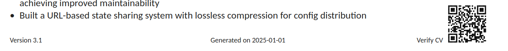
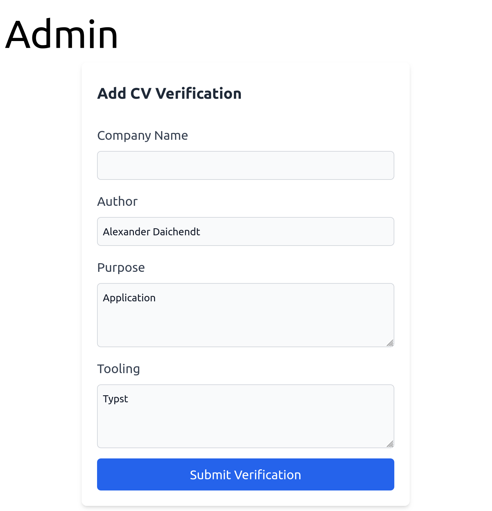

In my CV in the bottom right corner, I have a QR code that links to this website. The called page displays information to whom this CV was issued, when and for what purpose. I can revoke a CV in my backend and have it display a message that the CV is no longer valid, for example, when the current sent CV is outdated.

While the recipient can still store and process the CV, they can only use it for its intended purpose since others can verify who it was issued to through the QR code.
This is probably not very useful, but I think it's a cool little gimmick. It does give me some control over my CV, which is nice.


[QR code leads to this link](https://daichendt.one/cv?id=RtoiZRTN)


## How it works

On this astro page, I have a route `/admin` which allows me to create a new verification id. This endpoint is secured with Cloudflare access.

<div align="center" style={{ width: '500px', margin: '0 auto' }}>
  
</div>

The backend runs serverless with Astro on Cloudflare workers and stores the submitted data in a D1 (SQLite) database. When a request to the `/cv` route is made, the backend checks if the id is in the database and if it is still valid. Depending on that, it will display the data accordingly. Try it out!

For id generation, I am using nanoid with 8 characters. Initially, I utilized UUIDv4 but found it too long for a QR code. At about 80 characters in total, the generated QR code should be about 90px large according to [this tool](https://certifiedcalculator.com/qr-code-size-calculator/). 8 characters still provide a good amount of entropy such that it is unlikely to hit a collision if I were to apply daily for the next 100 years. Of course, collisions are handled in the backend.

A Typst document, which is the technology I use for my CV, renders at 96dpi, so the QR code should be about 2.3cm large according to [this tool](https://www.pixelto.net/px-to-cm-converter) to be optimally scannable even when printed out. With my much shorter nanoid and some additional url shortening, I managed to cut the required size to 1.5 cm.

The overall implementation is trivial and I will not spend time explaining the details. [This blogpost](https://snorre.io/blog/2024-05-06-likes-cloudflare-d1-astro-api-endpoints/) and [this blogpost](https://kevinkipp.com/blog/going-full-stack-on-astro-with-cloudflare-d1-and-drizzle/) explain the Astro + Cloudflare D1 setup in more detail.

On the Typst side, I am using following code to place the QR code in the bottom right corner of my CV:

```typst
#import "@preview/cades:0.3.0": qr-code

#let uuid = "REPLACEME"
#place(
  bottom + right,
  dx: 0cm,
  dy: 0.5cm,
  link("https://daichendt.one/cv?id=" + uuid)[
    #qr-code("https://daichendt.one/cv?id=" + uuid, width: 1.5cm)
  ],
)
```

This allows me to regex replace the `REPLACEME` with the generated id from the backend in a simple script alongside my other parameterized values. And that's it, I have a CV verification tool. I deliberately kept it as simple as possible with a trivial workflow to keep maintenance and the time it takes to create a new CV as low as possible. I am happy with the result.
