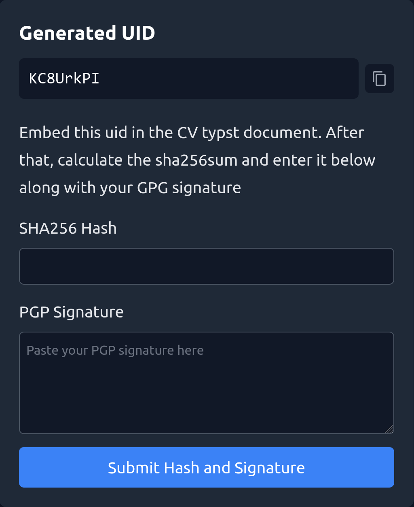

In my CV in the bottom right corner, I have a QR code that links to this website. The called page displays information to whom this CV was issued, when and for what purpose. I can revoke a CV in my backend and have it display a message that the CV is no longer valid, for example, when the current sent CV is outdated. Furthermore, the site shows the sha256 hash and a PGP signature of the CV, which can be used to verify the integrity and authenticity of the CV.

While the recipient can still store and process the CV, they can only use it for its intended purpose since others can verify who it was issued to through the QR code. If a third party were to manipulate the CV, the hash would not match the one on the website, and the PGP signature would not be valid.
Pretty cool gimmick! This effectively binds the CV document to my personal website and domain. It provides me more control over the CV and its usage, and it is a nice touch to show off my technical skills.


[QR code leads to this link](https://daichendt.one/cv?id=RtoiZRTN)


## How it works

On this astro page, I have a route `/admin` which allows me to create a new verification id. This endpoint is secured with Cloudflare access.

<div style={{
  maxWidth: '500px',
  width: '100%',
  margin: '0 auto',
  textAlign: 'center'
}}>
  
</div>

The backend runs serverless with Astro on Cloudflare workers and stores the submitted data in a D1 (SQLite) database. When a request to the `/cv` route is made, the backend checks if the id is in the database and if it is still valid. Depending on that, it will display the data accordingly. Try it out!

For id generation, I am using nanoid with 8 characters. Initially, I utilized UUIDv4 but found it too long for a QR code. At about 80 characters in total, the generated QR code should be about 90px large according to [this tool](https://certifiedcalculator.com/qr-code-size-calculator/). 8 characters still provide a good amount of entropy such that it is unlikely to hit a collision if I were to apply daily for the next 100 years. Of course, collisions are handled in the backend.

A Typst document, which is the technology I use for my CV, renders at 96dpi, so the QR code should be about 2.3cm large according to [this tool](https://www.pixelto.net/px-to-cm-converter) to be optimally scannable even when printed out. With my much shorter nanoid and some additional url shortening, I managed to cut the required size to 1.5 cm.

The overall implementation is trivial and I will not spend time explaining the details. [This blogpost](https://snorre.io/blog/2024-05-06-likes-cloudflare-d1-astro-api-endpoints/) and [this blogpost](https://kevinkipp.com/blog/going-full-stack-on-astro-with-cloudflare-d1-and-drizzle/) explain the Astro + Cloudflare D1 setup in more detail.

On the Typst side, I am using following code to place the QR code in the bottom right corner of my CV:

```typst
#import "@preview/cades:0.3.0": qr-code

#let uuid = "REPLACEME"
#place(
  bottom + right,
  dx: 0cm,
  dy: 0.5cm,
  link("https://daichendt.one/cv?id=" + uuid)[
    #qr-code("https://daichendt.one/cv?id=" + uuid, width: 1.5cm)
  ],
)
```

After entering the company name and submitting the shown form, a new uid is returned to the browser. Now I can create my CV with this custom uid by running my Typst build script which inserts the uid into the Typst document, compiles a pdf, creates a sha256 hash and a PGP signature of the pdf. The script looks like this:

```python
#!/usr/bin/env python3

import os
import shutil
import subprocess
import argparse
from pathlib import Path

CV_FILE = "cv.typ"

def main():
    parser = argparse.ArgumentParser(description="Build CV")
    parser.add_argument("-o", "--output", help="Output file", default="cv.pdf")
    parser.add_argument("-u", "--uid", help="unique CV ID", required=True)
    args = parser.parse_args()

    print("Building CV")
    # copy cv file to build directory
    os.makedirs("build", exist_ok=True)
    shutil.copy(CV_FILE, "build")

    path = Path("build/cv.typ")
    content = path.read_text().replace("REPLACE_ME", args.uid)
    path.write_text(content)

    # build cv
    subprocess.run(["typst", "compile", "build/cv.typ", args.output], check=True)
    print("CV built")
    shutil.rmtree("build", ignore_errors=True)

    # print sha256 hash of the output file
    sha256 = subprocess.run(["sha256sum", args.output], stdout=subprocess.PIPE, check=True).stdout.decode().split()[0]
    print(f"SHA256 hash of the output file: {sha256}")

    #  gpg --detach-sign --armor --output - cv.pdf
    gpg_sig = subprocess.run(["gpg", "--detach-sign", "--armor", "--output", "-", args.output], stdout=subprocess.PIPE, check=True).stdout.decode()
    print("GPG signature:")
    print(gpg_sig)


if __name__ == "__main__":
    main()
```

Finally, I enter the generated sha256 hash and the PGP signature into the second page of the create verification workflow.

<div style={{
  maxWidth: '500px',
  width: '100%',
  margin: '0 auto',
  textAlign: 'center'
}}>
  
</div>

And that's it, I have a CV verification tool. I deliberately kept it as simple as possible with a trivial workflow to keep maintenance and the time it takes to create a new CV as low as possible. I am happy with the result.
