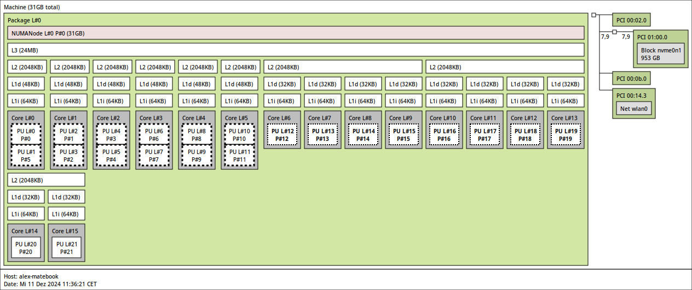

**UPDATE 24/08/2024**:
Having used this machine for a year soon, I can not recommend it. None of my issues have been resolved, some even gotten worse. The laptop's battery life is poor, often barely reaching 3 hours while having a text editor open. I pretty much depend on plugging the laptop into the wall, all the time to not degrade the battery more than necessary. The webcam, fingerprint, S3 and Xe drivers are still all pretty much broken. Bluetooth also behaves a bit strangely where it sometimes requires multiple attempts to connect.

---

I recently bought a Huawei MateBook X Pro 2024. It is a beautiful laptop with a 3:2 aspect ratio display and a touchscreen. The laptop comes with Windows 11 preinstalled. However, I wanted to run Linux on it. Here is a guide on what is needed to get Linux running on the Huawei MateBook X Pro 2024.

Overall, the experience was okay, but not something I would recommend to an average user. There are a fair bit of quirks that need to be ironed out. Especially distros running older kernels will have a hard time. I am running CachyOS with the latest 6.13-rc1 kernel, more on that later.

[Here](https://linux-hardware.org/?probe=b6dcf78af5) is a linux-hardware.org probe of my laptop.

| Hardware    | PCI/USB ID                                  | Status             |
| ----------- | ------------------------------------------- | ------------------ |
| CPU         |                                             | :white_check_mark: |
| Touchpad    | ps/2:7853-7853-bltp7840-00-347d             | :white_check_mark: |
| Touchscreen |                                             | :white_check_mark: |
| Keyboard    | ps/2:0001-0001-at-translated-set-2-keyboard | :white_check_mark: |
| WiFi        | 8086:7e40                                   | :white_check_mark: |
| Bluetooth   | 8087:0033                                   | :white_check_mark: |
| iGPU        | 8086:7d55                                   | :neutral_face:     |
| Audio       | 8086:7e28                                   | :ok:               |
| Webcam      | 8086:7d19                                   | :x:                |
| Fingerprint |                                             | :x:                |

## CPU

The CPU on my SKU is an Intel Meteor Lake Core Ultra 155H. It comes with 6 performance cores, each with 2 threads, 8 efficiency cores, one thread each, and 2 LPE cores. The p and e cores share 24MB of L3 cache. The LPE cores do not have L3 cache and share 2MB L2 cache, which makes them rather slow. Below you can find the output of `lstopo`:

Since thread director is not yet supported in the Linux kernel, by default, the scheduler will assign processes to the performance cores--while on battery. A scheduler like bpfland helps, but that still leaves the first, CPU core 0, alive. Disabling the cores manually is also not a good solution as the core 0 can not be deactivated. There used to be a kernel config option, `CONFIG_BOOTPARAM_HOTPLUG_CPU0` which would allow the core to be disabled at runtime, but is no longer available[^1].

Luckily, Intel is developing a tool which utilizes cgroups to enable/disable cores at runtime and moves processes away. If you care about battery life, you might want to configure `intel-lpmd`[^2].
After installing the tool, it must be enabled with `sudo systemctl enable --now intel-lpmd`. Next, enter your p cores into the config file at `/etc/intel_lpmd/intel_lpmd_config.xml`, so if you are running with SMT enabled, it would be the string `0-11` to include the 6 p-cores with 2 threads each. When you are on battery, the tool will disable the p-cores and move processes away. You can verify that it is active with `sudo systemctl status intel_lpmd.service`. For additional battery-savings, you can also disable the e-cores as the L3 cache can then be powered down. I would not recommend it tho.

## Touchpad

The touchpad worked out of the box ever since I got the laptop. I did read that older kernels might not register it.

## Touchscreen, Keyboard, Wifi, Bluetooth

No problems, as far as I can tell, all work out of the box.

## iGPU

This is a big one. Theres a problem with the default i915 driver which causes the iGPU to never go into a low power state. This is a big problem as it drains the battery rather quickly. There is an experimental Intel Xe driver, which fixes this issue. It can be enabled by adding the kernel parameters `i915.force_probe=!7d55 xe.force_probe=7d55` to the kernel command line. The driver is already in mainline, so no need to compile it yourself. However, the driver is still experimental there are several bugs. The screen might flicker from time to time showing rectangular artifacts. The 6.12 or lower Xe driver was highly unstable and caused my system to hard lock every few minutes. The 6.13-rc1 driver is much more stable, asides from the artifacts.

## Audio

The audio works out of the box. But its not great. It seems like not all speakers are fully used. It is good enough for me tho.

## Webcam

The webcam is an ipu6-based camera. Support has been trickling in over the years, but it is unusable at the moment and the forseeable future.

## Fingerprint

The fingerprint sensor is not supported at the moment. It does not even show up anywhere. One of those ingenious Goodix sensors that are not supported by the fprintd library.

---

Sources:

[^1]: https://www.kernelconfig.io/search?q=CONFIG_BOOTPARAM_HOTPLUG_CPU0&kernelversion=6.12.4&arch=x86

[^2]: https://github.com/intel/intel-lpmd
