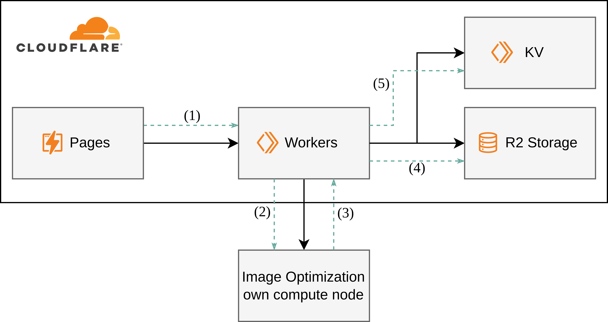

I wanted to use responsive images for my small page of cute [cats](/cat) (now removed as of 8/12/2024). Since
one of the design goals is to give my significant other, who by the way loves
cats a lot more than me, the option to add cats on the fly and also consume the
cat pictures in other services, I require dynamic image optimization.

Requirements:

- On demand addition of new images
- Optimization for different width and webp / progressive JPEG
- Served from the edge for lowest latencies

Since I've been working a lot with Cloudflare, I of course checked out their
[Image](https://developers.cloudflare.com/images/cloudflare-images/) offering.
While the service would exactly fulfill my requirements, it costs 5€/m, which I
currently can not afford. I thought, this was a good opportunity to build my own
little image optimization service, that I could maybe even use in the future for
other image-related projects.

## Infrastructure overview

I rely on Cloudflare services to serve the optimized images. On pages, this
Svelte website is hosted. For our API endpoints that this website is querying, I
utilize Cloudflare workers. The optimized images are stored on the new
Cloudflare R2 storage and an index is created on KV. Finally, I host the image
optimization program on a Raspberry Pi at my place. It is connected with a
Cloudflare tunnel to the internet. Any other device that has computing power and
is accessible via the internet is alright.

- **(1)**: a user uploads a new image, for example via this site
- **(2)**: the worker processes forwards the image to the image optimization server
- **(3)**: the optimization server does its thing and serves the optimized
  images in a folder. The worker is notified where the optimized images can be found.
- **(4)**: the worker fetches the images and stores them with a consistent naming scheme in
- **(5)**: an object containing metadata to the optimized image (location in R2) are inserted into KV
