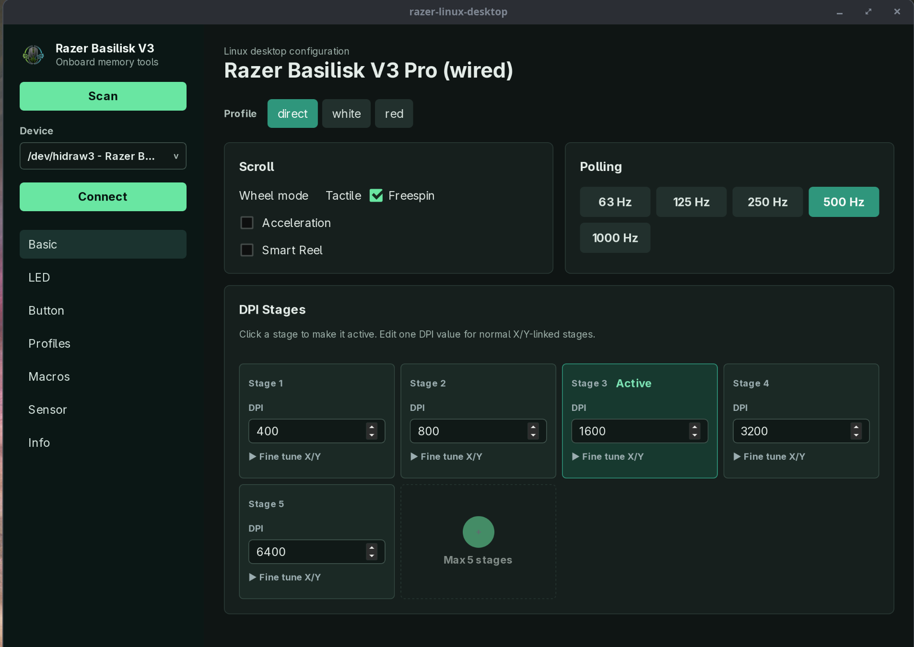

Unfortunately, Razer does not provide any software to configure their products on Linux (or rather fortunately, considering if they did, it would be crap).
Some Open Source solutions exist like [openrazer](https://openrazer.github.io/), but for whatever reason, they are only focusing on RGB, the part I am least interested in. 
A while ago, I found the comment of a fellow on Github [geezmolycos](https://github.com/geezmolycos/razerqdhid) who reverse engineered the USB HID protocol to send commands to the Basilisk V3 (not pro).

THe application is running through the browser with a weird mix of Python and VueJs, forcing me to use a WebUSB-compatible browser (not Firefox). I submitted a patch to that application as the protocol for the V3 Pro seemed identical to me after tinkering with a while, but I never was quite happy with how this web app worked. 
Thanks to GPT 5.5 I ported the app to Tauri / Leptos, now I have something that runs natively, doesn't look crappy and just works without any WebUSB annoyances. 

The code is here https://git.shiverpeak.xyz/alex/razer-linux-desktop. Feel free to compile and install it yourself.
If there's demand for it, I will consider setting up some CI for automatic AppImage creation.

