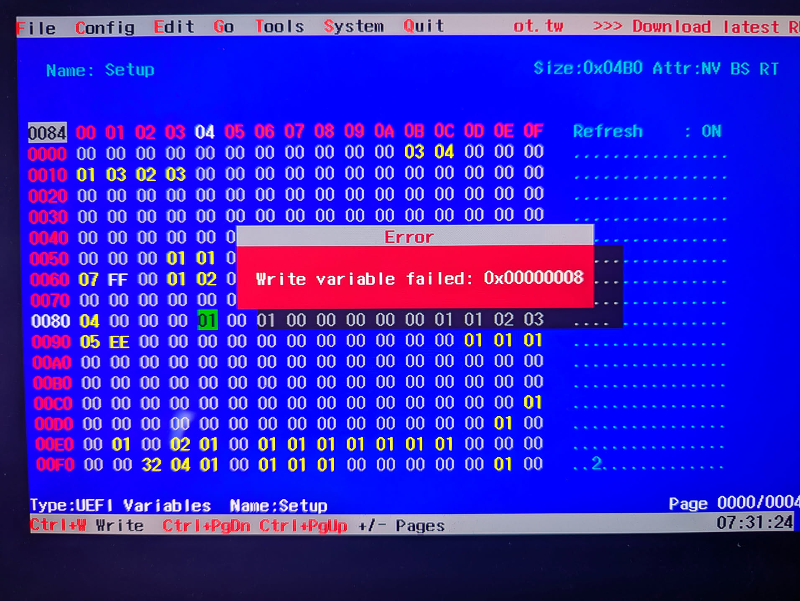

Recently, I've gotten back into working on my laptop's Linux compatibility. When I got the Laptop, I did a lot of research trying to get all of the hardeware to work on Linux (unsuccessfully). Now that we have Clankers that are reasonbly powerful sifting through massive amounts of data and executing lots of permutations swiftly, reverse engineering stuff is a lot more accessible.

One thing that always bugged me about my Huawei Matebook X Pro 2024 was the idle drain. When the lid is closed and it is suspended, it drains about 2% per hour.
Leave it for 2 days and its probably dead.
Back when I first investigated this issue, I already found out that technically, there is S3 sleep, but it does not put the laptop properly to bed nor does the laptop ever awake again. Maybe a Nightmare.

```
cat /sys/power/mem_sleep
s2idle [deep]
```

I've had a thought recently: can we throw an LLM at the bios and let it figure out what's blocking here?

Claude took apart the the BIOS quite swiftly, not even consuming too much of my usage limit on the $20 US plan.
Quite a few interesting insights that I did not know: 
- Firmware is a popular Insyde H20 capsule 
- Intel Boot Guard is present: running a new firmware is rejected by the CPU which basically kills our plan at a low level
- The BIOS itsself is signed with a PGP key
- There are hidden BIOS settings that are simply hidden from the UI. There is a setting for enabling S3 sleep! That's exactly what I was looking for.

Claude figured out quickly where we would need to flip a bit to turn on this setting.

```
Variable : Setup-a04a27f4-df00-4d42-b552-39511302113d
Offset   : 0x0084
Change   : 0x00 (disabled) → 0x01 (enabled)
```

The operating system mounts the NVRAM (non-volatile ram), the storage for the BIOS settings at `/sys/firmware/efi/efivars/`.
So how about, we write straight into that? Nope. You don't. It is read write protected. 

Claude insisted it is due to my IOMMU being turned on, but I quickly proofed that wrong by booting with `intel_iommu=off`. 
However, there is another way! We can load an UEFI shell on a FAT32 USB disk and boot into the USB disk. Maybe the protection was not on yet.
Using edk2-uefi and `setup_var.efi`, and after hours of excruciating back-and-fourth and figuring out the right incantation of comands to write the efi vars, I hit the same road block: no write permission.

```
setup_var.efi 0x0084 0x01 -n Setup -guid a04a27f4-df00-4d42-b552-39511302113d
```

Another idea: what if we use an UEFI editor like [RU.efi](https://github.com/JamesAmiTw/ru-uefi). Fun tool btw, but same result.
It does not seem to be easily possible to overwrite this value.



One final idea: maybe there is a secret keybind that enables the hidden menu.
People online have been saying there are various keybinds like holding Fn+Tab while booting which would bring up the hidden settings.
Claude believes that is not the case. I'm not sure I trust him with this assessment but I would not know how to verify it myself.

At this point, I gave up.
